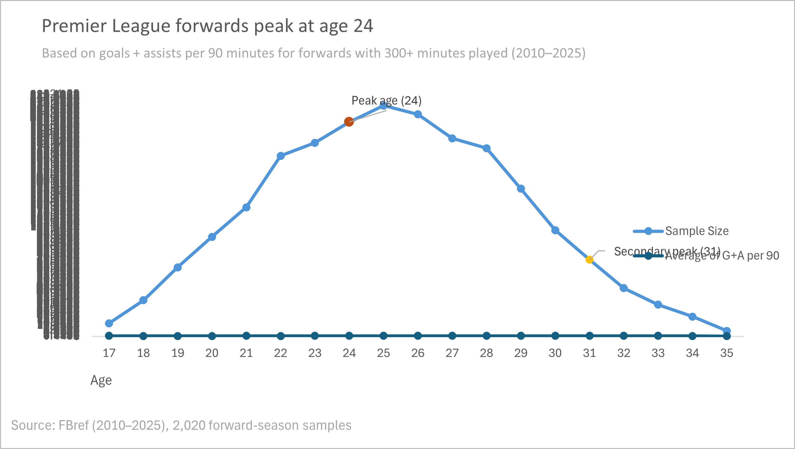

# Premier League Forwards Peak Performance Analysis (2010–2025)
Sports Analytics | Data Cleaning | SQL (BigQuery) | Power BI | Business Insights

---

## Executive Summary

Football clubs invest significant resources in attacking players, yet decisions around recruitment timing, contract length, and squad planning often lack clear evidence on when performance is most reliable.

In this project, I analyzed Premier League forward performance from 2010–2025 to identify the age at which attackers deliver peak and consistent output. Using Goals + Assists per 90 minutes as a standardized performance metric, I combined Excel-based data cleaning, SQL analysis in Google BigQuery, and Power BI dashboards to generate actionable insights.

The analysis shows that forward performance peaks in the mid-20s (approximately ages 24–27), where players combine high output, lower variability, and strong sample sizes. These insights can support data-driven recruitment, contract strategy, and risk management decisions.

*Average attacking output (Goals + Assists per 90) by age for Premier League forwards (2010–2025, ≥300 minutes). Highlighted points show peak ages at 24 and 31.*

---

## Business Problem

Clubs must decide when to invest in forwards, how long to extend contracts, and how to balance potential versus reliability.

Without understanding how performance evolves with age, teams risk overpaying for short-term peaks, misjudging decline phases, or relying too heavily on outlier seasons. This project addresses the question:

**At what age do Premier League forwards reach peak and most reliable attacking performance, and how does performance stability change across a player’s career?**

---

## Data & Preparation

- Source: FBref  
- League: English Premier League  
- Seasons: 2010–2025  
- Positions: Forwards only  
- Minimum threshold: ≥ 300 minutes played  

I personally collected the data and performed all preparation in Excel, including:
- Removing duplicate observations  
- Dropping unnecessary or redundant columns  
- Filtering to forward positions only  
- Applying a minutes-played threshold to improve reliability  
- Removing extreme outliers that could distort age-level averages  

The final cleaned dataset was used consistently for SQL analysis and Power BI visualization.

---

## Methodology

1. Cleaned and explored the data in Excel using pivot tables and charts.
2. Used SQL in Google BigQuery to aggregate attacking performance by age, measure variability, and identify elite performers.
3. Built Power BI dashboards to visualize performance trends, consistency, and elite-season distribution.

---

## Results

- Attacking output increases through the early 20s and peaks around ages 24–25.
- The mid-20s peak is supported by large sample sizes, indicating a stable performance window rather than a short-term spike.
- Players aged 24–27 show lower variability, making performance more predictable.
- Younger and older age groups exhibit higher volatility and rely more heavily on a small number of elite performers.
- Elite attacking seasons are most common in the mid-20s.

---

## Business Recommendations

If applied by a club’s analytics or recruitment department, these insights could support:
- Prioritizing forwards entering or within the mid-20s performance window.
- Improving contract timing and renewal decisions.
- Reducing risk associated with volatile age groups.
- Supporting data-backed discussions between scouting, analytics, and management teams.

---

## Skills Demonstrated

- Excel: Data cleaning, filtering, deduplication, pivot tables, exploratory analysis  
- SQL (BigQuery): Aggregations, standard deviation analysis, window functions  
- Power BI: Data modeling, dashboard design, analytical storytelling  
- Analytics Thinking: Translating data into business-relevant insights  

---

## Project Structure

- /data → Raw exploratory Excel file and final cleaned dataset  
- /sql → BigQuery SQL queries used in the analysis  
- /powerbi → Power BI dashboard (PDF for viewing, PBIX for technical review)  

---

## Conclusion & Next Steps

This analysis shows that forward performance peaks in the mid-20s, offering the best balance of output, consistency, and depth.

Future extensions could include controlling for team strength, expanding the analysis to other leagues, or modeling age-related decline to support long-term contract optimization.
